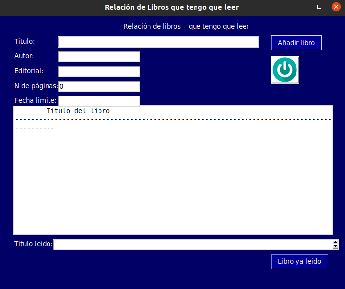
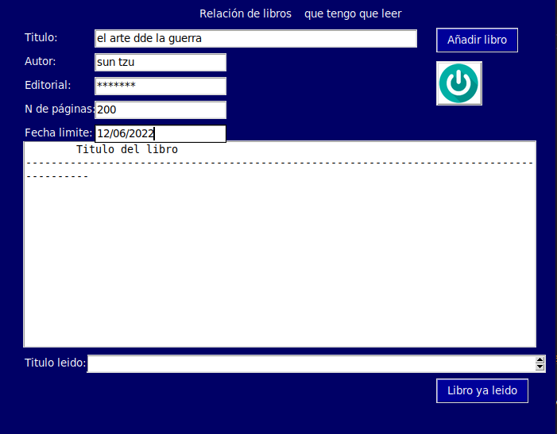
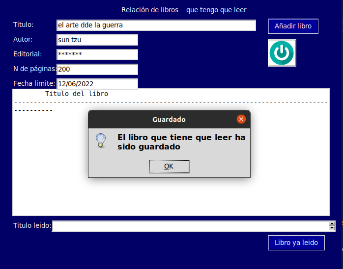
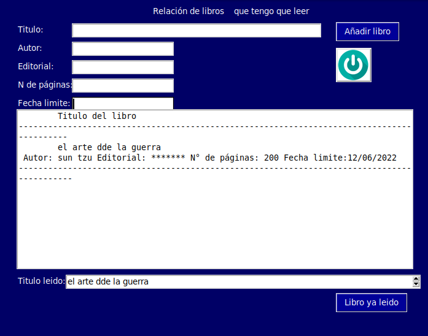
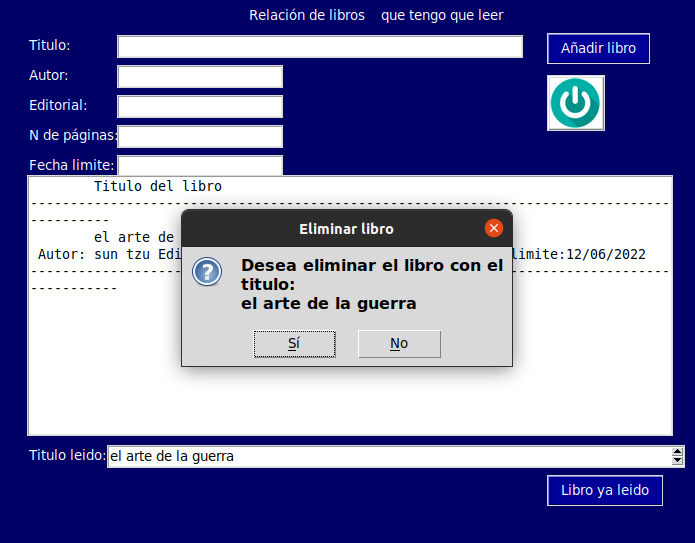

# Control- libros que tengo que leer
#

#
### en esta pagina podran guardar todos los libros que tengas que leer ya sea por pasar el tiempo, un libro del colegio o de la universida 
#
### primero llenamos las casiilas con la informacion requerida 
#

#
### cuando llenas los bloques con la informacion requerida le damos en añadir libro y al hacer esta accion nos va a aparecer el siguiente mensaje
#

#
### despues de eso se nos guardara la informacion y la podremos ver en donde dice titulo del libro

#
### nos quedara la informacion que colocamos en los cuadros guardada y en caso de que se haya completado dicha lectura podremos eliminarlo de la lista
#
